# Plant-Species-Image-Classification

##Teachable Machine: https://teachablemachine.withgoogle.com/models/937aD8eSN/

##Screenshot Drive link: https://drive.google.com/drive/folders/1WglyGos-yIOotcPLC3Sc6iu3QQnN3AKJ?usp=drive_link

# 🌿 B. Plant Species Section

This section presents the 20 selected tropical medicinal plants used in the image classification project.

---

# 🌿 Tropical Medicinal Plants Classification

| Image | Common Name | Scientific Name | Description |
|-------|-------------|----------------|-------------|
| 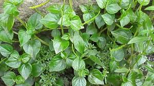 | Ulasimang Bato | *Peperomia pellucida* | Small succulent herb traditionally used for joint pain and inflammation. |
|  | Curry Leaf | *Murraya koenigii* | Aromatic shrub widely used in cooking and traditional herbal medicine. |
| 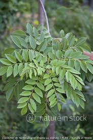 | Kakawate | *Gliricidia sepium* | Fast-growing tree used for fencing, shade, and soil improvement. |
| 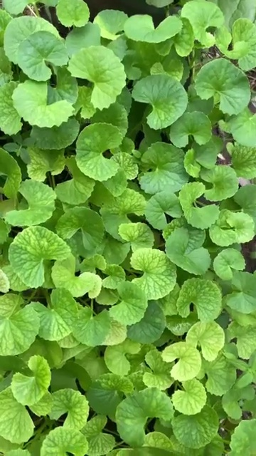 | Gotu Kola | *Centella asiatica* | Creeping herb known for memory enhancement and wound healing. |
| 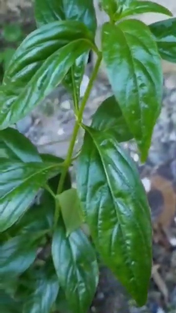 | Serpentina | *Rauvolfia serpentina* | Medicinal plant used for hypertension and calming effects. |
| 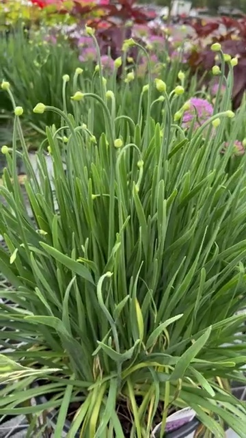 | Chinese Leeks | *Allium tuberosum* | Edible plant used in cooking and traditional remedies. |
| 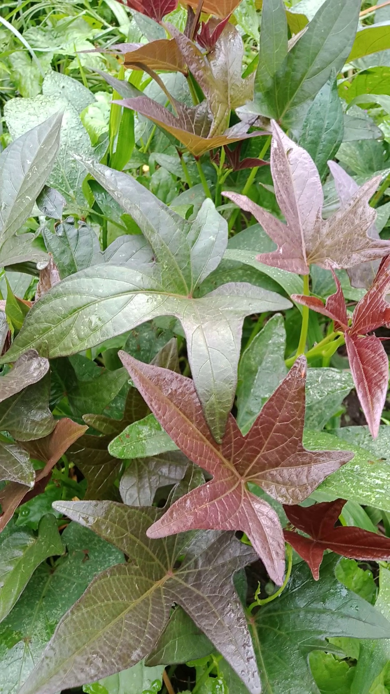 | Kamote Tops | *Ipomoea batatas* | Leafy vegetable rich in antioxidants and used for anemia support. |
| 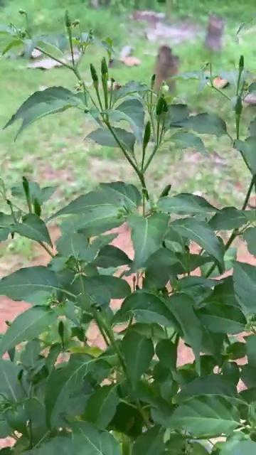 | Siling Labuyo | *Capsicum frutescens* | Small chili pepper used in food and for boosting metabolism. |
| 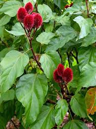 | Atsuete | *Bixa orellana* | Plant used as natural food coloring and traditional medicine. |
| 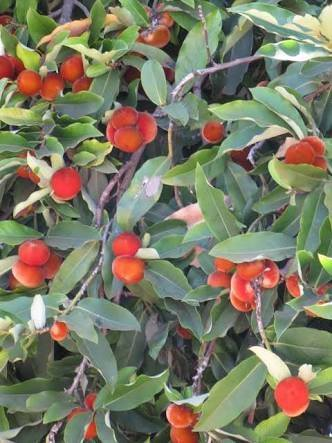 | Mabolo | *Diospyros blancoi* | Tropical fruit tree known for its edible fruit and medicinal bark. |
| 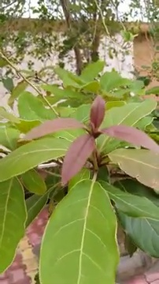 | Bibhitaki | *Terminalia bellirica* | Herbal plant used in Ayurvedic medicine for digestion support. |
| 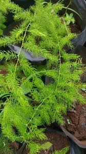 | Shatavari | *Asparagus racemosus* | Medicinal plant used for hormonal balance and reproductive health. |
| 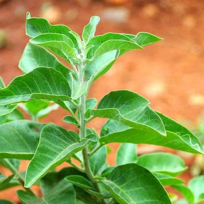 | Ashwagandha | *Withania somnifera* | Adaptogenic herb used to reduce stress and improve vitality. |
| 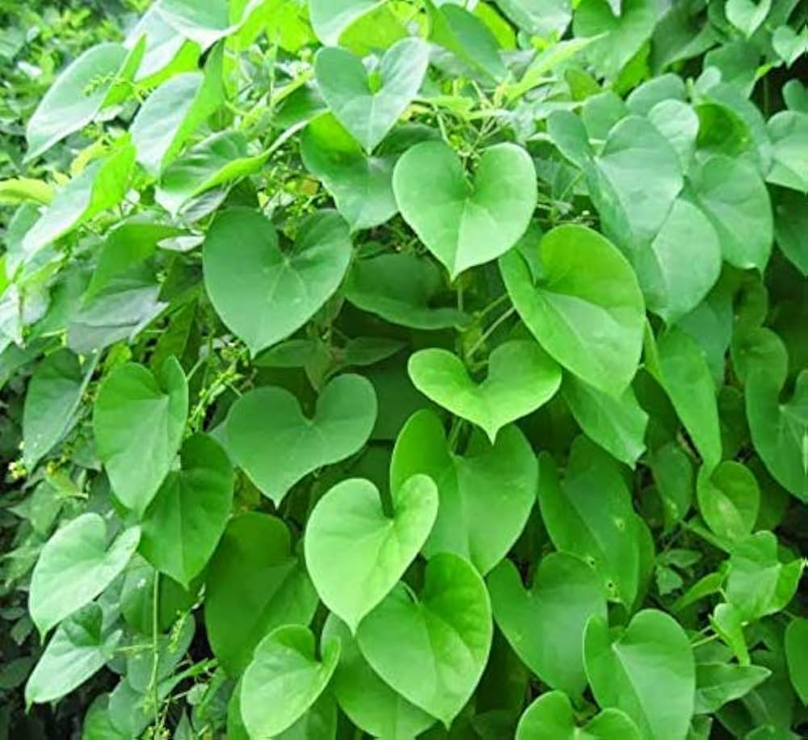 | Guduchi | *Tinospora cordifolia* | Climbing shrub known for boosting immunity. |
| 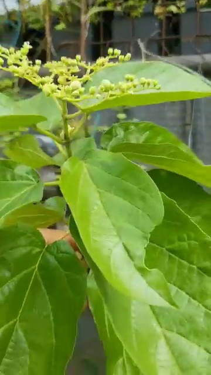 | Alagaw | *Premna odorata* | Traditional Filipino medicinal plant used for cough and fever. |
| 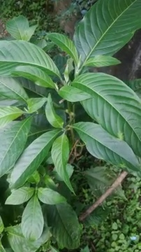 | Malabar Nut | *Justicia adhatoda* | Medicinal plant used for respiratory conditions. |
| 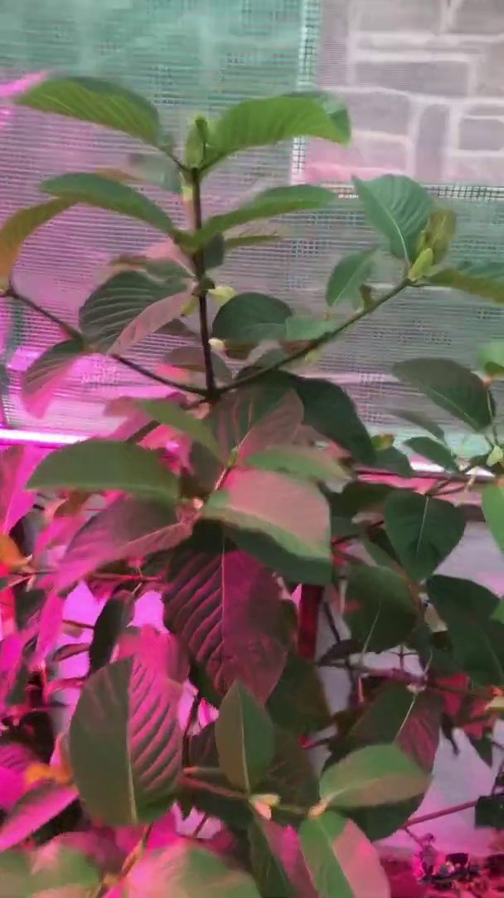 | Kratom | *Mitragyna speciosa* | Tropical tree known for its stimulant and medicinal properties. |
| 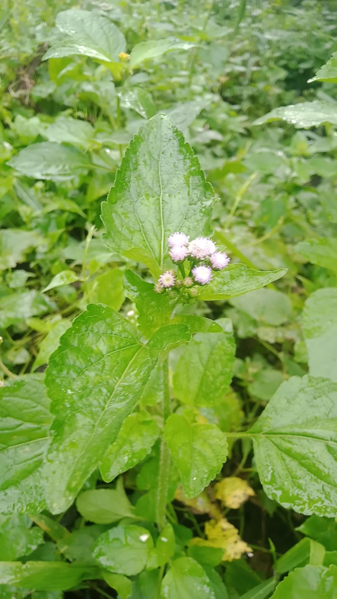 | Ageratum | *Ageratum conyzoides* | Medicinal herb used for wound healing and anti-inflammatory purposes. |
| 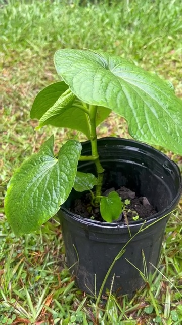 | Kava | *Piper methysticum* | Plant known for its calming and sedative effects. |
| 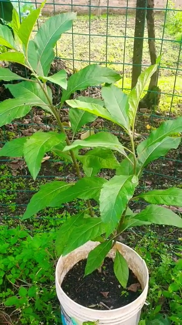 | Bitter Leaf | *Vernonia amygdalina* | Medicinal shrub used for digestion and blood sugar regulation. |

##Reflection Questions:

###Answer the following questions based on your experience:

####1. How did the number of images per class affect your model’s accuracy?
    #####Answer: Ang kadaghan sa images per class adunay dako nga epekto sa accuracy sa model. Sa akong case, naggamit ko og kapin sa 300 images per plant species, nga mas taas kaysa minimum requirement nga 250. Tungod ani, mas nakat-on ang model sa lain-laing anggulo, lighting, ug hitsura sa tanom. Resulta ani, mas taas ang confidence score ug mas sakto ang prediction sa model. Kung gamay ra ang images, mas taas ang chance nga mag-misclassify ang model tungod sa kulang nga training data.

####2. Which plant species were most commonly misclassified and why?
    ####Answer: Ang mga plant species nga parehas og porma sa dahon o parehas og kolor mao ang mas dali ma-misclassify. Pananglitan, ang ubang herbal plants nga parehas og green leaves ug shape mahimong maglibog ang model sa pag distinguish nila. Kini nahitabo tungod kay ang visual features sa ilang dahon parehas, ug usahay parehas usab ang background sa images. Ang similarity sa features mao ang main reason sa misclassification.
    
####3. How did changing the epochs, batch size, or learning rate affect the training results?
    ####Answer: Ang paggamit og 50 epochs nakatabang sa model nga mas makakat-on ug mas mo-improve ang accuracy over time. Ang batch size nga 16 naghatag og balance sa training speed ug performance. Ang learning rate nga 0.001 nakatabang sa stable nga learning process ug nakapugong sa sudden errors sa model. Kung taas kaayo ang learning rate, mahimong dili stable ang training, ug kung gamay ra kaayo ang epochs, dili makakat-on og tarong ang model.
    
####4. What challenges did you encounter during dataset collection and labeling?
    ####Answer: Usa sa main challenges mao ang pag pangita og daghang high-quality images nga klaro ug walay watermark. Lisod usab pangitaon ang images nga lain-lain ang anggulo ug lighting. Dugang pa, kinahanglan sigurohon nga sakto ang labeling sa kada plant species aron malikayan ang training errors. Ang pag organize sa images sa sakto nga classes nanginahanglan usab og oras ug effort.
    
####5. If you were to improve your model, what specific changes would you make and why?
    ####Answer: Kung akong i-improve ang model, magdugang ko og mas daghang images per class aron mas makakat-on ang model sa mas daghang variations sa plant species. Pwede usab nako usbon ang training parameters sama sa pag increase sa epochs aron mas ma improve ang accuracy. Dugang pa, mag gamit ko og mas diverse nga dataset nga adunay lain-lain nga backgrounds ug lighting conditions aron mas mahimong robust ug accurate ang model sa real-world situations.
